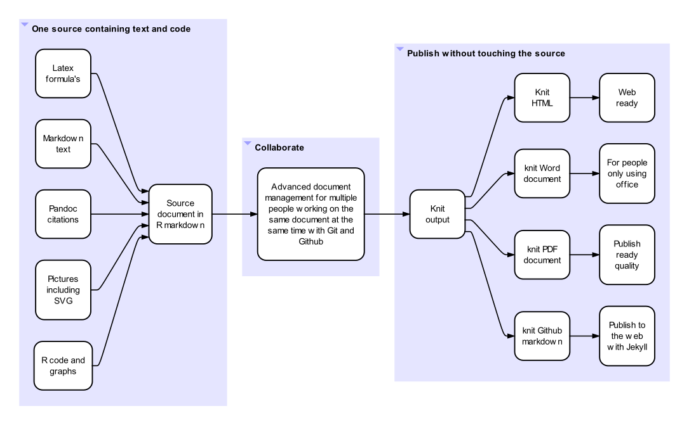
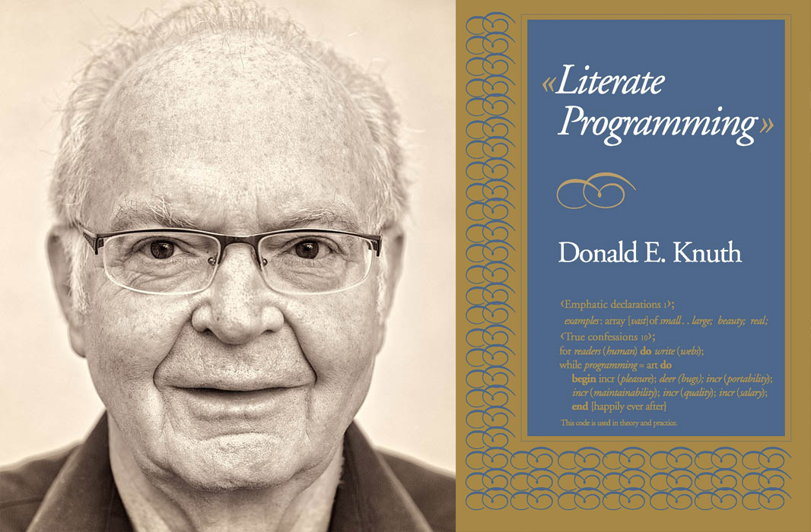

**I feel we have all the tools to create a better scientific worklow. One that facilitates free information sharing, reproducible science and real collaboration. This first post gives the outline.***

# One integral reproducible source
It is hard be integral and reproducible - to yourself and to others - if what you do is scattered in many pieces. Hence the popularity from documents containing Text and code at the same time. 

Mathematicians like to use Latex so they can include their formula's in the text. Many even like to mix include live calculations and the resulting graphs. For example in the "notebooks" of iPython, mathematica and RStudio. In programming no one less than Donald Knuth spearheaded the "literate programming" movement.

I will show how R Markdown is ideally suited to contain many different types of source material as outlined in the picture. It is also nice that all mentioned tools are free and open source. Incidently, markdown is also much easier to work with than the (admittedly more powerful) Latex.

# Real collaboration
Collaboration is a really popular word these days but ask yourself this: can some brilliant kid in another country freely read what you have written and easily propose specific changes in the document that you can integrate in the document with mininum fuss?

I would argue that this was exactly what happened during the development of Linux. Imagine keeping track of the many contributions of thousands of contributors through endless iterations. And no sloppy work allowed: one typo can bring the whole program crashing down. I think this process should be an inspiration for those calling themselves scientists. The big publishers will not like because it undermines their earnings but tools like Git and sites like Github make it really easy to implement...

# Write once - publish anywhere
With the process we just described you can quickly merge the contributions of others, make some last improvements to your text, calculations and graphs, rerun" your document and then... with just a few commands... your HTML document, PDF, Word document or web page is out the door.
